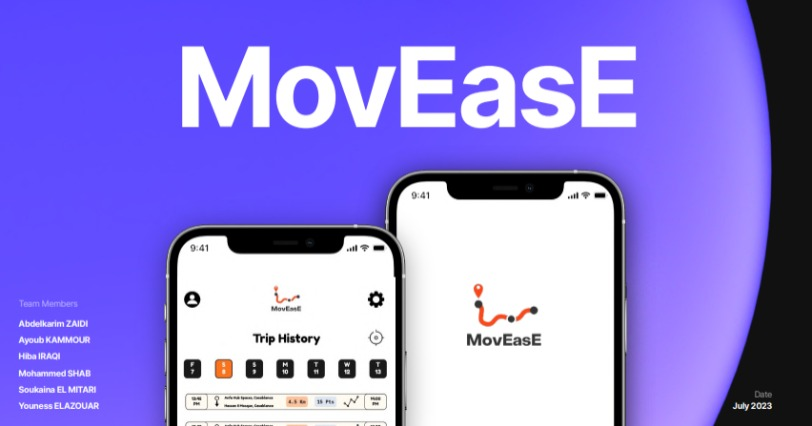

## Portfolio

---

### Latest Projects: 

[**English version**: Statistical Evaluation of the impact of the type of smile appearing in a fraudster's file on leniency](/project)
   
[**Version française**: Évaluation statistique de l’impact du type de sourire accompagnant le dossier d’un fraudeur sur le degré de clémence qu’on lui accorde](/projectfr)

[Download ALX Team Pitch Presentation](/pdf/MovEase_Presentation.pdf)

---
[CV: ](/pdf/CV-Website-FR.pdf)

---
[Resume: ](/pdf/CV-Website-ENG.pdf)

    

        [CV: ](/pdf/CV-Website-FR.pdf) 
        
    

    

        [Resume: ](/pdf/CV-Website-ENG.pdf) 
        
    

