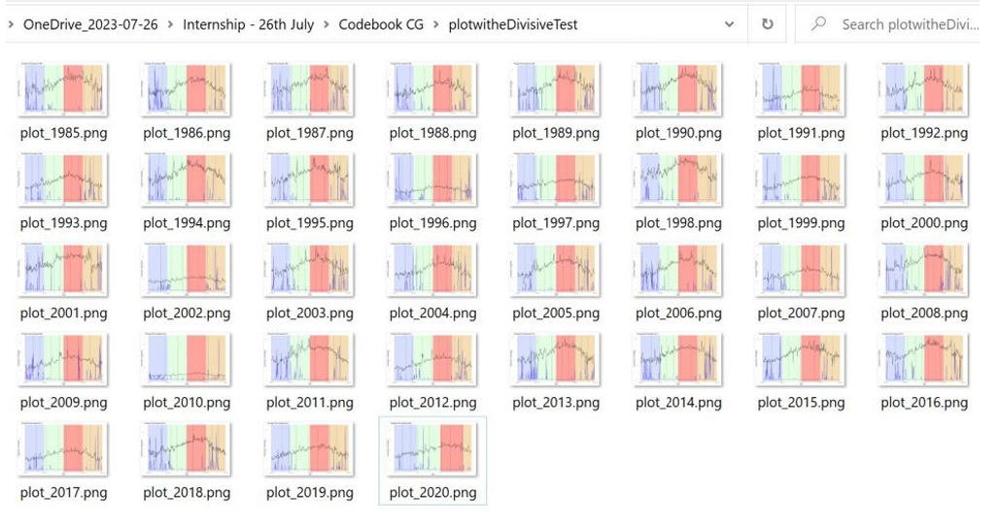
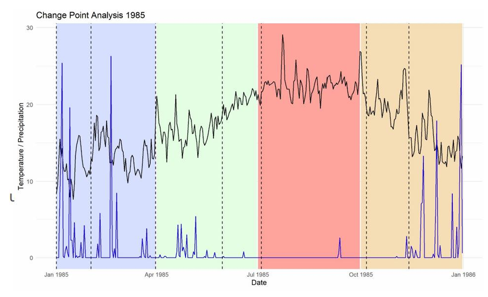

# Impact of climate change in Morocco, temporal characterization of temperature, rainfall and seasonal lag
## Introduction
The impact of climate change on the agricultural sector has direct repercussions on food security, the agricultural economy and environmental sustainability. The magnitude of the impact depends in turn on exposure to climatic hazards, the sensitivity of agricultural products, land and practices to these changes, and the adaptive capacities of the agricultural sector. 

  Exposure to climatic hazards is characterized on the basis of regional temperature and precipitation time series. Regions experiencing rising temperatures and significant variations in precipitation are more exposed to climate-related hazards, including heatwaves, floods, droughts and storms, which can have devastating effects on crops and livestock.  

In addition, the sensitivity of agricultural products, land and farming practices to these changes is crucial. Certain crops, soils and farming practices are more vulnerable to new climatic conditions, which can lead to lower yields or crop losses.  
Finally, the adaptive capacities of the agricultural sector, such as the adoption of climate-resilient cultivation techniques and the development of early warning systems, are essential to mitigate the impacts of climate change on agriculture. A thorough understanding of these interconnected factors is essential for developing strategies to ensure Morocco's long-term food security. 

The focus is on characterizing the evolution of climatic variables in order to assess the exposure of different Moroccan regions to climate change. 
## Objectives
The aim is to characterize the impact of climate change on temperature, rainfall by region and seasonal shifts.
## Methodology
### Measurement of the impact of climate change on seasonal lag
Development of a tool to help interpret climate data and the different phases through which temperature and precipitation change. The primary objective was to use this tool to define a season by aggregating the different evolutionary periods. 

Quantify the temporal position of the usual change-points (where the joint distribution of mean_temp and precipitation changes) and its variance using historical data, in order to calculate the deviation from these values of the change-points of our current observations. We use the e.divisive() function in the ecp package, which performs non-parametric analysis of multiple change points in multivariate data. This approach enables us to detect changes in distribution that are not only marginal but also joint. 

Here, multiple change points are estimated by iteratively applying a single change point location procedure. At each iteration, the location of a new change point is estimated so as to divide an existing segment. Consequently, the progression of this method can be represented as a binary tree. In this tree, the root node corresponds to the case where there is no change point and therefore contains the entire time series. All other non-root nodes are either a copy of their parent, or correspond to one of the new segments created by the addition of a change point to their parent. 
The statistical significance of an estimated change point is determined by a permutation test, since the distribution of the test statistic depends on the distributions of the observations, which are generally unknown. Let's assume that at the k -th iteration, the current set of change points has segmented the time series into k segments S1, S2, . . ., Sk, and that we have estimated the number of change points in the time series. Sk, and that we have estimated the location of the next change point as ˆτk, which has an associated test statistic value of q0. 

We then obtain our permuted sample by permuting the observations in each of the segments S1, . . . Sk. Then, conditional on the locations of the previously estimated change points, we estimate the location of the next change point in our permuted sample, ˆτk,r, together with its associated test statistic value qr. Our approximate p-value is then calculated as ˆp = #{r : qr ≥ q0}/(R + 1), where R is the total number of permutations performed 
### Characterization of climatic variables: temperature and precipitation  
#### Data source: Crop Growth Monitoring System - Morocco 

As part of the E-AGRI project, the Institut National de la Recherche Agronomique (INRA) has launched a national system for monitoring the agricultural season and predicting the agrometeorological impact of cereal harvests, known as CGMS-MAROC (Crop Growth Monitoring System - Morocco). CGMS-MAROC is piloted by INRA and managed in a formal consortium with the Direction de la Météorologie Nationale (DMN) and the Direction de la Stratégie et des Statistiques (DSS). The development of CGMS-MAROC was made possible thanks to technological collaboration with international research institutions, namely: the Flemish Institute for Research and Technology (VITO), the European Union's Joint Research Center (JRC), the Wageningen University Research Institute (Alterra) and the University of Milan (UNIMI). The CGMS-MAROC is thus the first operational system for monitoring the agricultural season and agrometeorological prediction of cereal harvests in Morocco, institutionalized by a strategic partnership that enables its development and sustainability. 
 
The CGMS-MAROC monitors crop development based on meteorological conditions, soil characteristics and crop parameters. 
 
The CGMS-MAROC consists of three levels: 
Level 1: Collection of meteorological data and interpolation on a 9x9 km square grid over the entire country; 
 
Level 2: Simulation of crop growth, using several agrometeorological simulation models; 
 
Level 3: Crop prediction using a combined approach involving parametric and non-parametric statistical analysis of meteorological data, simulation data and satellite data. 
##### Data format  
Daily observations from 01/01/1980 to 23/09/2023 of maximum, minimum and mean temperatures and cumulative rainfall cancelling each September for each region.
##### Data preparation 
-Conversion from .xls to .csv format using Excel 

-Data processing and preparation for analysis. Missing data are replaced by a method of imputation by the last observation with a check on their quality before and after imputation using summary statistics.  
##### Analysis and graph production  
-Disaggregation of the rainfall variable to derive daily rainfall 

We opt for an analysis approach that takes into account the seasonal aspect as follows: 
A season begins on the first of the month and is characterized as follows: Spring: [April,June] Summer: [July, September] Autumn: [October,December] Winter: [January,March] 
Based on daily mean temperatures, we generate an annual time series of seasonal maximum and minimum temperatures. The kernel density estimation method is used to cut off the extremities of the distribution so as not to include outliers and to be as faithful as possible to actual heat stress conditions. 

In this way, we are interested only in those values that represent 95% of the variations recorded. And we eliminate the tails to the right and left of the distribution using the cumulative distribution function. 

From these intervals we can see how their extent evolves each year, whether it's increasing or decreasing. In the case of rising minimum temperatures, if the range remains constant, even more warm temperatures are reached; if the range decreases, perhaps we don't reach temperatures that are really warm. In this case, we need to compare the evolution of the range with the evolution of the minimum temperature.If the range increases, you're bound to reach even warmer temperatures than if the range were constant, and so on. 

We generate graphs of temperature_intervals, range_of_variation, upper_bounds and lower_bounds and precipitation. 
Temperature intervals: Intervalle de variation de températures moyennes 

Range of variation: A measure of the extent of the average temperature variation interval.  

Upper bounds: Maximum temperatures reached on the basis of mean temperatures.  

Lower bounds: Minimum temperatures reached based on mean temperatures  

Total_rainfall: Precipitation 

We look for regions with the least variability in terms of temperature intervals per season. To do this, we use the coefficient of variation. CV=(Standard deviation /Average)×100. 
## Results
### Measuring the impact of climate change on seasonal lag  
The inter-variability between years of climate data is significant, even if we restrict ourselves to the interval [1985,2020] and do not analyze the years 2021,2022,2023, where the evolution is presumed to be bi-seasonal. 

Reproducibility of results: I have started a series of tests to check whether the temporal extent of the data influences the detection of the different phases through which the climatic data pass. Recall that at each iteration, the location of a new point of change is estimated in such a way as to divide an existing segment. Consequently, the progression of this method can be represented in the form of a binary tree. It is possible that if the time span is reduced, for example from 2 years to 1 year, the results will no longer be the same. 
Fortunately, the detection results after one and two years and more are the same. This would have been a significant problem, as the complexity of our method is non-linear. In other words, as the number of observations increases, the processing time doesn't increase by the same proportion - it explodes. In our case, the computational complexity is O(kT^2), where k is the number of estimated change points and T is the number of observations. We assume that k is constant and does not vary much over the years. This is verified in the case of our data. Let's take tr the processing time of one year. The processing time for [1985,2020] in our case will be 36*36*tr, i.e. 1296*tr. So, if it takes us 1 minute to analyze 1 year, 36 years will take us 22 hours. 

Reliability: 

Applying this technique to the Casablanca-Anfa data, we note that the number of phases through which the evolution of climatic data passes remains fairly limited between 1985 and 2020: between 6 and 8 approximately. 2010 is an aberrant year due to flooding.
 Source: Author
#### How the tool works: data
We insert the raw climatic data from the MND, and the path to the folder where we want to store the images in the automation_of_plots function. 
And here's the result: analysis over the years becomes easier. 

Source: Author
Here's a snapshot of 1985. Blue=Winter Green=Spring Red=Summer Orange=Autumn (Spring runs from April 1 to June 30) and so on for the other seasons. 

The same can be done for changes in precipitation patterns. 
It remains a tool to help interpret climatic data and the different phases through which temperature and precipitation pass. 
### Characterization of climatic variables: temperature and precipitation  
We plot the temperature ranges for each season, the range of temperature variation for each region of Morocco, as well as the upper and lower temperature limits and their temporal evolution. We also plot total precipitation for each year. This is automated in a script in a Jupyter Notebook.
## Discussion
We approach efforts to mitigate the consequences of climate change from a strategic, conjunctural and international angle. 
### An integrated national strategy 
Climate variability has always been a constraint to the development of Morocco's agricultural sector. Climate change scenarios show that the Kingdom's climate will become increasingly arid as a result of falling rainfall and rising temperatures, as well as more frequent extreme events. These changes will undoubtedly have a negative impact on the availability of water resources and biodiversity, as well as on the agricultural landscape. Indeed, over the last 70 years, twenty regions have experienced climatic drought. 
To mitigate the effects of climate change, the agricultural strategy, which is fully in line with Morocco's policy to combat climate change and the National Strategy for Sustainable Development, has adopted two key components: adaptation to climate change and mitigation of the effects of greenhouse gases. The adaptation effort focused mainly on irrigation water management, while the mitigation effort involved extending plantations to increase carbon sequestration potential and reduce greenhouse gas emissions. 
### Irrigation water control and management programs 

Irrigation has been placed at the heart of cross-functional reforms designed to address the growing scarcity of water resources. The Green Morocco Plan has given pride of place to the control and rationalization of irrigation water in order to improve agricultural production and productivity, while guaranteeing the efficient and sustainable use of water resources in a context marked by climate change. The water control and management policy of the Green Morocco Plan is based on three structuring irrigation programs: 

-The Programme National d'Economie de l'Eau d'Irrigation (PNEEI): which aims to develop localized irrigation over an area of 550,000ha by 2020, in order to improve the efficiency of irrigation water use in agriculture, which will ultimately save and valorize nearly 1.4 billion m 3 of water. By the end of 2019, nearly 585,000 ha had been equipped with drip irrigation, exceeding the 2020 target of 550,000 ha. 

-The Irrigation Extension Program (PEI): aims to create new perimeters and strengthen the irrigation of existing perimeters dominated by dams built or programmed over an area of 130,000 ha, to remedy the under-utilization of nearly 1.2 billion m 3 of water mobilized by dams for irrigation. By the end of 2019, some 82,280 ha had been equipped or were under construction. 
-The Public-Private Partnership (PPP) program: in the irrigation sector, aims to improve the technical, economic and financial conditions for managing the irrigation water service in perimeters. This program aims to preserve the water table by mobilizing non-conventional water through various projects, including irrigation safeguard projects and seawater desalination projects. By the end of 2019, 4 Public-Private Partnership irrigation projects had been contracted, including two seawater desalination projects for the irrigation of Chtouka-Ait Baha (15,000 ha) and Dakhla (5,000 ha). 

By the end of 2019, these irrigation programs, launched as part of the Green Morocco Plan, will have made it possible to develop and modernize almost 800,000 ha under irrigation, i.e. around 50% of the national irrigated area. A total of 36.1 billion DH has been invested in 235,000 farms, enabling more than 2 billion m 3 of irrigation water to be saved and valorized annually, including 1.6 billion m 3 under the PNEEI water-saving scheme. The area under drip irrigation has risen from 9% of the irrigated area in 2008 to 37% in 2019. 
### Cereal conversion and fruit tree intensification programs 
### Cereal conversion and fruit tree intensification programs 
To combat the effects of climate change in the long term, while improving farmers' incomes in the long term, the Green Morocco Plan has adopted a program to convert cereal crops that are sensitive to climate variability to more resilient crops that make better use of the land, in particular fruit plantations. This program is complemented by intensification and densification programs, which consist in rehabilitating and maintaining existing plantations in order to enhance agricultural production and make the most of the improvements introduced by modernized irrigation infrastructures, mechanization, improved cultivation practices, production enhancement, etc. 

In fact, the proactive management of climate change, particularly drought, and the preservation of natural resources are integrated into the design of all the agricultural projects of the Green Morocco Plan, notably through the targeting of land use and the diversification and intensification of agricultural activities. This is likely to improve farmers' incomes, diversify their sources of income and reduce their precariousness and vulnerability to climatic hazards.
### Climate risk coverage program 
In order to strengthen the climate risk coverage system, a multi-risk climate insurance program has been developed. This program is of great importance in a context of climatic variability, since it enables a shift from a crisis management approach to a risk management approach, and thus contributes to improving farmers' resilience in the face of climatic hazards linked to drought, excess water, hail, frost and strong winds and sand. To this end, two insurance products have been introduced: 

Climatic multi-risk insurance for cereals, pulses and oilseeds: This insurance covers areas ranging from 326,000 ha in 2011-2012 to over one million hectares as of 2016. 

The climatic multi-risk guarantee program for fruit growing: set up in 2014, against the main climatic hazards (hail, excess water, frost, strong wind, high temperatures and chergui). 
### Ecosystem and biodiversity conservation programs 
These programs are mainly carried out within the framework of the Development Strategy for the Oasis and Argan Zones, which targets the development of these fragile zones in economic, social and environmental terms, and the National Program for the Development of Rangelands and the Regulation of Transhumant Flows, which aims to ensure the sustainable management of pastoral resources, the creation of pastoral reserves and the planting of fodder shrubs over more than 650,000 ha, as well as the securing of water resources in these zones. This structuring program and the mechanisms provided for by law n°113-13 have contributed to the sustainable management of pastoral areas and the regulation of transhumance flows. 
### Short-term plans 
#### Program to reduce the impact of the 2023 rainfall deficit 
This program, designed by the government to reduce the impact of drought and the effects of the economic situation, and to restore balance to production chains, has a budget of around 10 billion dirhams. It has three main components: Protecting animal capital, protecting plant capital and supporting sectors, and strengthening Crédit Agricole's financing capacities”, notes a press release from the head of government. 
Under the terms of the agreement, a sum of 5 billion DH will be allocated to the protection of animal capital, through the subsidization of barley and imported feedstuffs for livestock and poultry. A total of 4 billion DH will be allocated to protecting plant capital and supporting sectors, by subsidizing the prices of certain inputs, such as seeds and fertilizers, in order to lower production costs for a range of vegetables and fruit. Lastly, 1 billion DH will be allocated to strengthen the financial capacities of the Crédit Agricole bank in order to support farmers. 

In order to reduce the cost of producing a range of staple vegetables, whose prices have risen as a result of higher input costs, notably seeds and fertilizers, the program will subsidize tomato seeds and seedlings to the tune of MAD 1 billion, and certified potato seeds to the tune of MAD 580 million. A budget of 120 million dirhams will be allocated to reducing the cost of onion production by supporting the purchase of seeds, while 2.3 billion dirhams will be allocated to subsidizing fertilizers, the price of which has risen as a result of the current economic situation.    
### International
#### FAO
To guide the partnership and cooperation between the Government of Morocco and the FAO, the FAO Representation in Morocco works within the FAO Country Programming Framework (CPF) for Morocco, which defines the priorities for collaboration and the results to be achieved in the medium term, in support of national development objectives in agriculture, rural development and food security.  

The latest addition to this long-standing cooperation is the 2017-2020 FAO Country Programming Framework for Morocco, for which the second priority area is the sustainable, inclusive and integrated management of natural resources and fragile areas in the face of climate change.  
This area of priority focuses on strengthening national capacities for the efficiency, productivity and sustainability of water resources, capacity building for the sustainable management of forest resources, knowledge transfer for the revitalization of oasis and argan areas, and their promotion as ingenious systems of world agricultural heritage, participative co-management of watersheds in mountain areas,  technical assistance to national institutions for the safe destruction of obsolete pesticides, national capacity-building for the fight against soil degradation and sustainable land management, and technical support to national institutions for the implementation of the Paris Agreement and the Nationally Determined Contribution under the United Nations Framework Convention on Climate Change (UNFCCC). 

Five (5) projects contributing to this second priority are currently underway: 

OASIL project: “Revitalizing oasis agro-ecosystems through a sustainable, integrated and landscape-based approach in the Draâ-Tafilalet region (OASIL)”. -GCP/MOR/046/GFF 

-Project “Elimination of obsolete pesticides and implementation of the pest and pesticide management program in Morocco” -GCP/MOR/041/GFF 

-Sub-regional project on “Reuse of wastewater and drainage water for agricultural purposes”-GCP/SNE/3701 
-Project “Modernization of irrigation in Morocco” -UTF/MOR/038/MOR 

-Regional project “Implementing the 2030 agenda for water efficiency/productivity and water Sustainability in NENA countries” -GCP/RNE/009/SWE 

-Territorial plan to combat global warming, Souss Massa Region 

Partners: Secretariat of State for Water, Mines and Sustainable Development, Souss Massa Region, GIZ. 
#### World Bank
On June 9, 2023, the World Bank's Board of Directors approved a $350 million loan to support Morocco's measures to combat climate change and improve the country's resilience to the worsening climate impacts already being felt. The Program for Results funding encourages efforts to integrate climate policies within government and strengthen coordination mechanisms to accelerate the climate transition. It complements and reinforces the World Bank's other climate transition commitments and financing in the country at sector level (notably water, agriculture, social protection and health). 
The new program will help the Moroccan government accelerate the implementation of its Nationally Determined Contributions (NDCs), which underline the Kingdom's commitments to combat global warming by reducing its greenhouse gas emissions, as well as its resolve to strengthen the country's resilience to climate shocks. The program's design builds on recommendations emanating from Morocco's National Climate and Development Report (CCDR) 2022, which identifies a series of guiding principles for urgent action, including the need for a whole-of-government approach, the creation of a robust climate data system to facilitate decision-making, and the absolute necessity of protecting vulnerable groups and ecosystems from climate change. 

 

The new financing is focused on strengthening institutional and political capacities to integrate climate change into development policies and programs,” said Jesko Hentschel, Country Director for Maghreb and Malta at the World Bank. To achieve this, this funding will help improve policy tools and systems, data management, and the performance of fiscal and financial institutions, while strengthening coordination between agencies and ministries in different sectors.” 
## Conclusion
In conclusion, I had the opportunity to explore in depth the impacts of climate change on the agricultural sector. This has enabled me to understand that these impacts are multidimensional, depending on exposure to climatic hazards, the sensitivity of agricultural products and the sector's capacity to adapt. I tried to characterize the evolution of climatic variables. This work has also made me aware of the importance of agricultural and environmental policies, and of innovation in the development of sustainable solutions for agriculture in the face of climate challenges. I would like to express my gratitude to DSS for providing me with this enriching learning opportunity. 
