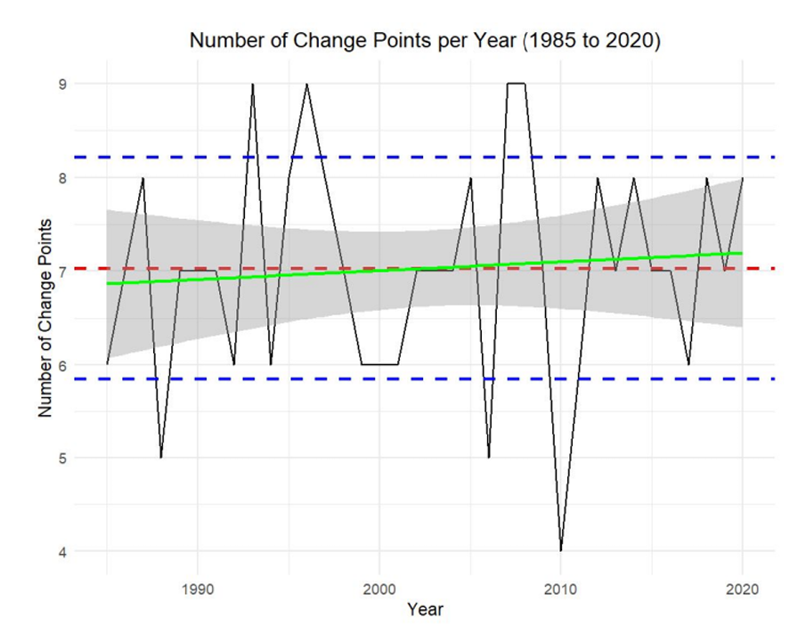

# Impact des changements climatiques au Maroc, caractérisation temporelle de la température, pluviométrie et du décalage saisonnier
## Introduction
L'impact du changement climatique sur le secteur agricole entraîne des répercussions directes sur la sécurité alimentaire, l'économie agricole et la durabilité environnementale. L’amplitude de l’impact dépend tour à tour de l'exposition aux aléas climatiques, de la sensibilité des produits, terres et pratiques agricoles à ces changements ainsi que des capacités d’adaptation du secteur agricole. 

  L’exposition aux aléas climatiques est caractérisée à partir de l'évolution des séries temporelles de la température et des précipitations par région. Les régions connaissant une augmentation des températures et des variations importantes des précipitations sont plus exposées aux risques liés au climat, notamment les canicules, les inondations, les sécheresses et les tempêtes, qui peuvent avoir des effets dévastateurs sur les cultures et le bétail.  

De plus, la sensibilité des produits agricoles, des terres et des pratiques agricoles à ces changements est cruciale. Certaines cultures, sols et pratiques agricoles sont plus vulnérables aux nouvelles conditions climatiques, ce qui peut entraîner des rendements plus faibles ou des pertes de récoltes.  

Enfin, les capacités d'adaptation du secteur agricole, telles que l'adoption de techniques de culture résilientes au climat et le développement de systèmes d'alerte précoce, sont essentielles pour atténuer les impacts du changement climatique sur l'agriculture. Une compréhension approfondie de ces facteurs interconnectés est indispensable pour élaborer des stratégies visant à garantir la sécurité alimentaire marocaine à long terme. 

L’intérêt est porté sur la caractérisation de l’évolution des variables climatiques  afin d’évaluer l’exposition au changement climatique des différentes régions marocaines. 
## Objectifs
On œuvre à caractériser l’impact des changements climatiques sur la température, pluviométrie par région et aussi le décalage saisonnier
## Méthodologie
### Mesure de l’impact du changement climatique sur le décalage saisonnier
Elaboration d’un outil d’aide à l’interprétation des données climatiques et des différentes phases dont passe l’évolution de la température et de la précipitation. L’objectif primaire était de parvenir à définir ce qu’est une saison à l’aide de cet outil en agrégant les différentes périodes d’évolution. 

Quantifier la position temporelle des change-points usuels (où la distribution conjointe de mean_temp et precipitation change) et sa variance à l’aide des données historiques, ceci pour calculer la déviation par rapport à ces valeurs des change-points de nos observations actuelles. Interpréter empiriquement la valeur de ces change-points On utilise la fonction e.divisive() du package ecp qui fait de l’analyse non paramétrique des points de changement multiples de données multivariées. Cette approche permet de détecter des changements de distribution non seulement marginale mais aussi conjointe. 

Ici, plusieurs points de changement sont estimés en appliquant de manière itérative une procédure de localisation d'un seul point de changement. À chaque itération, l'emplacement d'un nouveau point de changement est estimé de manière à diviser un segment existant. Par conséquent, la progression de cette méthode peut être schématisée sous la forme d'un arbre binaire. Dans cet arbre, le nœud racine correspond au cas où il n'y a pas de point de changement et contient donc toute la série temporelle. Tous les autres nœuds non-racine sont soit une copie de leur parent, soit correspondent à l'un des nouveaux segments créés par l'ajout d'un point de changement à leur parent. 

La signification statistique d'un point de changement estimé est déterminée par un test de permutation, étant donné que la distribution de la statistique du test dépend des distributions des observations, qui sont généralement inconnues. Supposons qu'à la k -ème itération, l'ensemble actuel de points de changement ait segmenté la série temporelle en k segments S1, S2, . . ., Sk, et que nous ayons estimé le nombre de points de changement dans la série temporelle. Sk, et que nous avons estimé l'emplacement du prochain point de changement comme étant ˆτk, qui a une valeur de statistique de test associée de q0. 

Nous obtenons ensuite notre échantillon permuté en permutant les observations dans chacun des segments S1, . . . , Sk. Ensuite, conditionnellement aux emplacements des points de changement précédemment estimés, nous estimons l'emplacement du point de changement suivant dans notre échantillon permuté, ˆτk,r, ainsi que la valeur de la statistique de test qr qui lui est associée. Notre valeur p approximative est alors calculée comme ˆp = #{r : qr ≥ q0}/(R + 1), où R est le nombre total de permutations effectuées 
### Caractérisation des variables climatiques : température et précipitations  
#### Source de données : Crop Growth Monitoring System – Maroc 
Un système national de suivi de la campagne agricole et de prédiction agro météorologique des récoltes céréalières, appelé « CGMS-MAROC » (Crop Growth Monitoring System – Maroc), a été initié par l’Institut National de la Recherche Agronomique (INRA), dans le cadre du projet E-AGRI. Le CGMS-MAROC est piloté par l’INRA et géré en consortium formel avec la Direction de la Météorologie Nationale (DMN) et la Direction de la Stratégie et des Statistiques (DSS). Le développement de CGMS-MAROC a été possible grâce à une collaboration technologique avec des institutions de recherche internationales, à savoir : l’Institut Flamand pour la Recherche et la Technologie (VITO), le Centre de Recherche Commun de l’Union Européenne (JRC), l’Institut de Recherche de l’Université de Wageningen (Alterra) et l’Université de Milan (UNIMI). Le CGMS-MAROC est ainsi le premier système opérationnel de suivi de la campagne agricole et de prédiction agrométéorologique des récoltes céréalières au Maroc, institutionnalisé par un partenariat stratégique qui permet son développement et sa pérennisation. 
 
Le CGMS-MAROC surveille le développement des cultures, à partir des conditions météorologiques, des caractéristiques des sols et des paramètres des cultures. 
 
Le CGMS-MAROC est constitué de trois niveaux : 
 
Niveau 1 : La collecte des données météorologiques et leur interpolation sur une grille carrée de 9x9 km sur tout le territoire national ; 
 
Niveau 2 : La simulation de la croissance des cultures, par plusieurs modèles de simulations agrométéorologiques ; 
 
Niveau 3 : La prédiction des récoltes à partir d’une approche combinée, mettant à contribution des analyses statistiques paramétriques et non paramétriques des données météorologiques, des données de simulation et des données satellitaires. 
##### Format des données  
Observations journalières depuis le 01/01/1980 au 23/09/2023 des températures maximales, minimales, moyennes et une pluviométrie cumulative s'annulant chaque Septembre de chaque région
#####  Préparation des données 
-Conversion du format .xls a .csv à l’aide d’Excel 

-Traitement des données et préparation à l’analyse. Les données manquantes sont remplacées par une méthode d’imputation par la dernière observation avec un check sur leur qualité avant et après imputation à l’aide de statistiques de synthèse.  
##### Analyse et production de graphiques  
-Désagrégation de la variable pluviométrie pour dégager une pluviométrie journalière 

On opte pour une approche d’analyse qui prend en considération l’aspect saisonnier ainsi : 

Une saison débute du premier du mois et est caractérisée comme suit : Printemps: [Avril,Juin] Eté: [Juillet, Septembre] Automne: [Octobre,Décembre] Hiver: [Janvier,Mars] 
On génère depuis les températures moyennes journalières une série temporelle annuelle de températures maximales et minimales saisonnières. On utilise pour cela la méthode d’estimation de la densité par noyau pour couper les extrémités de la distribution afin de ne pas inclure les valeurs aberrantes et être le plus fidèle aux conditions réelles de stress thermique. 

Ainsi, on ne s’intéresse qu’aux valeurs qui représentent 95% des variations enregistrées. Et on élimine les queues a droite et a gauche de la distribution a l’aide de la fonction de distribution cumulative. 

De ces intervalles on peut voir comment évolue leur étendue chaque année, est ce que ca augmente ou diminue. Dans le cas ou la température minimale augmente, si l’étendue reste constante, on atteint encore plus de températures chaudes, si l’étendue diminue, peut-etre que l’on n’atteint pas des températures qui sont vraiment chaudes, il faut comparer l’évolution de l’étendue et l’évolution de la température minimale dans ce cas. Si l’étendue augmente, forcément on atteint des températures encore plus chaudes que si l’étendue était constante, et ainsi de suite. 

On génère des graphes de temperature_intervals, range_of_variation, upper_bounds et lower_bounds et précipitations. 

Temperature intervals : Intervalle de variation de températures moyennes 

Range of variation : Une mesure de l’étendue de l’intervalle de variation des températures moyennes  

Upper bounds : Températures maximales atteintes a partir des températures moyennes  

Lower bounds : Températures minimales atteintes a partir des températures moyennes  

Total_rainfall: Précipitations 

On cherche les régions ayant le moins de variabilité en termes d’intervalles de température par saison. On utilise pour cela le coefficient de variation. CV=(Ecart-type /Moyenne​)×100. 
## Résultats
### Mesure de l’impact du changement climatique sur le décalage saisonnier  
L’inter-variabilité entre les années des données climatiques est importante même si on ne se restreint qu’a l’intervalle [1985,2020] et l’on ne s’adonne pas a analyser les années 2021,2022,2023 ou l’évolution est présumée bi-saisonnière. 

Reproductibilité des résultats : J’ai entamé une série de tests pour vérifier si l’étendue temporelle des données influence la détection des différentes phases que traversent les données climatiques. On rappelle qu’a chaque itération, l'emplacement d'un nouveau point de changement est estimé de manière à diviser un segment existant. Par conséquent, la progression de cette méthode peut être schématisée sous la forme d'un arbre binaire. Il est possible si l’on diminue l’étendue temporelle, par exemple de 2 ans a 1 an que les résultats ne soient plus les mêmes. 

Fort heureusement, les résultats de détection au bout d’un an et de deux ans et plus sont les mêmes. Ceci aurait été un problème non négligeable car la complexité de notre méthode n’est pas linéaire. C’est-à-dire qu’au fur et à mesure qu’on augmente les observations, le temps de traitement n’augmente pas avec la même proportion, il explose. Dans notre cas, la complexité de calcul est O(kT^2), où k est le nombre de points de changement estimés et T le nombre d'observations. On suppose que k est constant et ne varie pas beaucoup au cours des ans. Ce qui est vérifié dans le cas de nos données. Prenons tr le temps de traitement d’un an. Le temps de traitement de [1985,2020] dans notre cas sera de 36*36*tr c-à-d 1296*tr. Ainsi, s’il nous prend 1 minute pour analyser 1 an, 36 ans nous prendra 22 heures. 

Par rapport à la fiabilité : 

En appliquant cette technique aux données de Casablanca-Anfa, on remarque que le nombre de phases dont passe l’évolution des données climatiques reste assez restreinte entre 1985 et 2020.Entre 6 et 8 environ. 2010 est une année aberrante à cause des inondations.
 Source: Auteur
#### Fonctionnement outil: données
On insère les données climatiques brutes de la DMN, et le chemin du dossier ou on veut stocker les images dans la fonction automation_of_plots. 

Et voici le résultat : L’analyse à travers les années devient plus facile. 

Source: Auteur
Voici un aperçu de l’année 1985. Bleu=Hiver Vert= Printemps Rouge=Eté Orange=Automne (Le printemps débute du 1er avril au 30 Juin) et ainsi de suite pour les autres saisons. 

On peut faire de même pour le changement de l’allure des précipitations. 
Ça reste un outil d’aide à l’interprétation des données climatiques et des différentes phases dont passe la température et la précipitation. 
### Caractérisation des variables climatiques : température et précipitations  
On trace les intervalles de température pour chaque saison, l'intervalle de variation des températures pour chaque région du Maroc ainsi que les limites supérieures et inférieures de la température et leur évolution temporelles. On trace aussi le graphe des précipitations totales pour chaque année. Ceci est automatisé dans un script dans un Jupyter Notebook.
## Discussion
Nous abordons les efforts visant à atténuer les conséquences du changement climatique sous un angle à la fois stratégique, conjoncturel et international 
### Une stratégie nationale intégrée 
La variabilité climatique a toujours constitué une contrainte au développement du secteur agricole au Maroc. Aussi, les scénarios de changements climatiques montrent que le climat du Royaume tendra de plus en plus vers plus d’aridité comme conséquence de la baisse des précipitations et de l’augmentation de la température, en plus de l’apparition plus fréquente d’évènements extrêmes. Ces changements auront certainement des effets négatifs sur notamment les disponibilités en ressources hydriques et en biodiversité et sur le paysage agricole. En effet, au cours des 70 dernières années, vingt campagnes ont connu une sécheresse climatique. 
Pour atténuer les effets des changements climatiques, la stratégie agricole, et en parfaite cohérence avec la politique marocaine de lutte contre le changement climatique et la Stratégie Nationale de Développement Durable, a adopté les deux composantes clés à savoir l’adaptation aux changements climatiques et l'atténuation des effets des gaz à effet de serre. L’effort d’adaptation a porté principalement sur la maîtrise de l’eau d’irrigation tandis que l’effort d’atténuation a concerné notamment l’extension des plantations pour augmenter le potentiel de séquestration du carbone et réduire les émissions de gaz à effet de serre. 
### Programmes de maitrise et de gestion de l’eau d’irrigation 
L’irrigation a été placée au centre des réformes transversales structurantes visant à faire face à la raréfaction des ressources en eau. Le Plan Maroc Vert a accordé une place de choix à la maîtrise et à la rationalisation de l’eau d’irrigation afin d’améliorer la production et la productivité agricole tout en garantissant une utilisation efficiente et durable des ressources hydriques dans un contexte marqué par les changements climatiques. La politique de maitrise et de gestion de l’eau dans le cadre du Plan Maroc Vert s’articule autour de trois programmes structurants d’irrigation : 

    Le Programme National d’Economie de l’Eau d’Irrigation (PNEEI) : qui vise à l’horizon 2020, le développement de l’irrigation localisée sur une superficie de 550 000ha, afin d’améliorer l’efficience de l’utilisation de l’eau d’irrigation en agriculture, ce qui permettra à terme d’économiser et de valoriser près de 1,4 milliard de m 3 d’eau. A fin 2019, près de 585 000 ha ont été équipés en goutte à goutte, en dépassement de l’objectif de 2020 qui était de 550 000 ha. 

    Le Programme d’Extension de l’Irrigation (PEI) : a pour objectif la création de nouveaux périmètres et le renforcement de l'irrigation des périmètres existants dominés par les barrages réalisés ou programmés sur une superficie de 130 000 ha, et ce pour remédier à une sous-valorisation de près de 1,2 milliard de m 3 d’eau mobilisée par les barrages destinés à l’irrigation. A fin 2019, près de 82.280 ha sont équipés ou en cours d’équipement dans le cadre de ce programme. 

    Le Programme du Partenariat Public-Privé (PPP) : dans le domaine de l’irrigation vise à améliorer les conditions techniques, économiques et financières de la gestion du service de l’eau d’irrigation dans les périmètres. Ce programme vise la préservation de la nappe par la mobilisation des eaux non conventionnelles à travers divers projets dont les projets de sauvegarde de l’irrigation et les projets de dessalement de l’eau de mer. A fin 2019, 4 projets de Partenariat Public Privé en irrigation ont été contractés dont deux projets de dessalement de l’eau de mer pour l’irrigation de Chtouka-Ait Baha (15 000 ha) et de Dakhla (5 000 ha). 

Ces programmes d’irrigation lancés dans le cadre du Plan Maroc Vert ont permis, à fin 2019, d’aménager et moderniser près de 800 000 ha sous irrigation, soit environ 50% de la superficie irriguée au niveau national. L’investissement consenti a été de 36,1 milliards de DH au profit de 235 000 exploitations, ce qui a permis d’économiser et de valoriser annuellement plus de 2 milliards de m 3 d’eau d’irrigation dont 1,6 milliard de m 3 au titre des économies d’eau du PNEEI. La superficie irriguée en goutte à goutte est passée de 9% de la superficie sous irrigation en 2008 à 37% en 2019. 
### Programmes de reconversion des céréales et d’intensification de l’arboriculture fruitière 
Afin de lutter durablement contre les effets des changements climatiques tout en améliorant de façon pérenne les revenus des agriculteurs, le Plan Maroc Vert a adopté le programme de reconversion des cultures céréalières sensibles à la variabilité climatique par des cultures plus résilientes et plus valorisantes de la terre, notamment les plantations fruitières. A ce programme s’ajoute les programmes d’intensification et de densification qui consistent à réhabiliter et à entretenir les plantations existantes afin d’améliorer la production agricole pour valoriser les améliorations introduites par la modernisation des infrastructures d’irrigation, la mécanisation, l’amélioration des pratiques culturales, la valorisation de la production, etc. 

En fait, la gestion proactive du changement climatique, notamment la sécheresse et la préservation des ressources naturelles sont intégrées dans la conception de l’ensemble des projets agricoles du Plan Maroc Vert, à travers notamment le ciblage de la vocation des terres, la diversification et l’intensification des activités agricoles. Ce qui est de nature à améliorer le revenu des agriculteurs, en diversifier les sources et atténuer leur précarité et leur vulnérabilité aux aléas climatiques.
### Programme de couverture des risques climatiques 
Afin de renforcer le système de couverture des risques climatiques, un programme d’assurance multirisque climatique a été développé. Ce programme revêt une grande importance dans un contexte de variabilité climatique puisqu’il permet de passer d’une approche de gestion de la crise à une approche de gestion du risque et contribue ainsi à l’amélioration de la résilience des agriculteurs face aux aléas climatiques liés à la sécheresse, à l’excès d’eau, à la grêle, au gel et aux vents forts et de sable. Dans ce cadre, deux produits d’assurance ont été mis en place : 

    L’assurance multirisque climatique pour les céréales, les légumineuses et les oléagineux : Cette assurance a permis de couvrir des superficies allant de 326 000 ha en 2011-2012 pour atteindre plus d’un million d’hectares à partir de 2016. 

    Le programme de garantie multirisque climatique pour l’arboriculture fruitière : mis en place en 2014, contre les principaux aléas climatiques (grêle, excès d’eau, gel, vent violent, hautes températures et chergui). 
### Les programmes de conservation des écosystèmes et de la biodiversité 
Ces programmes sont menés principalement dans le cadre de la Stratégie de Développement des Zones Oasiennes et de l’Arganier, qui cible le développement de ces zones fragiles sur les dimensions économique, sociale et environnementale, et du Programme National de Développement des Parcours et de Régulation des flux de transhumants qui vise la gestion durable des ressources pastorales, la création de réserves pastorales et la plantation d’arbustes fourragers sur plus de 650 000 ha ainsi que la sécurisation des ressources en eau au niveau de ces zones. Ce programme structurant et les mécanismes prévus par la loi n°113-13 ont contribué à la gestion durable des espaces pastoraux et la régulation des flux de transhumance. 
### Plans conjoncturels 
#### Programme de réduction de l’impact du déficit pluviométrique 2023 
Ce programme, élaboré par le gouvernement en vue de réduire l’impact de la sécheresse et les effets de conjoncture et de restaurer l’équilibre des chaînes de production, est doté d’une enveloppe d’environ 10 milliards de dirhams. Il comprend trois axes qui sont : La protection du capital animal, la protection du capital végétal et le soutien aux filières, et le renforcement des capacités de financement du Crédit Agricole", note un communiqué du chef du gouvernement. 

Aux termes de la convention, un montant de 5 milliards de DH sera alloué à la protection du capital animal, à travers la subvention de l’orge et des aliments importés destinés au bétail et à la volaille. Une enveloppe de 4 milliards de Dh sera allouée à la protection du capital végétal et au soutien des filières, à travers la subvention des prix de certains intrants, comme les semences et les engrais, afin de permettre la baisse des coûts de production d’une série de légumes et fruits. Enfin, une enveloppe de 1 milliard de Dh sera affectée au renforcement des capacités financières de la banque Crédit Agricole en vue de soutenir les agriculteurs. 

Afin de réduire le coût de production d’un ensemble de légumes de base, dont les prix ont connu une augmentation du fait du renchérissement des prix des intrants, notamment les semences et engrais, il sera procédé dans le cadre de ce programme à la subvention des semences et plants de tomate pour 1 milliard de DH et à la subvention des semences certifiées de la pomme de terre pour 580 millions de dirhams. Une enveloppe de 120 millions de dirhams sera destinée à la réduction du coût de production de l’oignon à travers le soutien à l’acquisition des semences, alors que 2,3 milliards de DH seront alloués à la subvention des engrais dont les prix ont accusé une hausse du fait de la conjoncture actuelle.    
### A l'international
#### FAO
Afin d’orienter le partenariat et la coopération entre le Gouvernement du Maroc et la FAO, l’intervention de la Représentation de la FAO au Maroc s’inscrit dans le Cadre de Programmation Pays (CPP) de la FAO pour le Maroc qui définit les priorités de la collaboration ainsi que les résultats à atteindre à moyen terme, pour soutenir les objectifs nationaux de développement en matière d’agriculture, de développement rural et de sécurité alimentaire.  

Le dernier-né de cette longue coopération est le Cadre de Programmation Pays 2017-2020 de la FAO pour le Maroc pour lequel le deuxième domaine prioritaire est la gestion durable, inclusive et intégrée des ressources naturelles et des espaces fragiles face au changement climatique.  

Ce domaine prioritaire concerne essentiellement : le renforcement des capacités nationales pour l’efficience, la productivité et la durabilité des ressources en eau, le renforcement de capacités de gestion durable des ressources forestières, le transfert de connaissances pour la revitalisation des espaces oasiens et de l’arganier, et leur promotion en tant que systèmes ingénieux du patrimoine agricole mondial, la cogestion participative des bassins versants dans les zones de montagne,  l’assistance technique aux institutions nationales pour la destruction sécurisée des pesticides obsolètes, le renforcement des capacités nationales pour la lutte contre la dégradation des sols et la gestion durable des terres et l’accompagnement technique des institutions nationales pour la mise en œuvre de l’Accord de Paris et de la Contribution Déterminée au niveau National dans le cadre de la Convention-cadre des Nations unies sur les changements climatiques (CCNUCC). 

Actuellement cinq (5) projets qui contribuent à cette deuxième priorité sont en cours : 

    Projet OASIL : « Revitaliser les agroécosystèmes oasiens à travers une approche durable, intégrée et paysagère dans la région de Draâ-Tafilalet (OASIL) » -GCP/MOR/046/GFF 

    Projet « Elimination des pesticides obsolètes et mise en œuvre du programme de gestion des ravageurs et des pesticides au Maroc » -GCP/MOR/041/GFF 

    Projet sous-régional sur « la réutilisation des eaux usées et de drainage à des fins agricoles»-GCP/SNE/3701 

    Projet « Modernisation de l’irrigation au Maroc » -UTF/MOR/038/MOR 

    Projet régional “Implementing the 2030 agenda for water efficiency/productivity and water Sustainability in NENA countries” -GCP/RNE/009/SWE 

    Plan territorial de lutte contre le réchauffement climatique, Région Souss Massa 

Partenaires : Secrétariat d’Etat Eaux, Mines, Développement Durable, Région Souss Massa, GIZ. 
#### Banque mondiale
Le 9 Juin 2023, le Conseil d’administration de la Banque mondiale a approuvé un prêt de 350 millions de dollars afin de soutenir les mesures prises par le Maroc pour lutter contre le changement climatique et améliorer la résilience du pays face à l’aggravation des impacts climatiques déjà ressentis. Le financement du Programme pour les résultats encourage les efforts d’intégration des politiques climatiques au sein du gouvernement et le renforcement des mécanismes de coordination permettant d’accélérer la transition climatique. Il complète et renforce les autres engagements et financements de la Banque mondiale en faveur de la transition climatique dans le pays au niveau sectoriel (notamment l’eau, l’agriculture, la protection sociale et la santé). 

Le nouveau programme aidera le gouvernement marocain à accélérer la mise en œuvre de ses Contributions déterminées au niveau national (CDN) qui soulignent les engagements du Royaume à lutter contre le réchauffement de la planète grâce à la réduction de ses émissions de gaz à effet de serre, ainsi que sa résolution de renforcer la résilience du pays face aux chocs climatiques. La conception du programme s’appuie sur les recommandations émanant du Rapport national sur le climat et le développement du Maroc (CCDR) 2022, qui identifie une série de principes directeurs pour des actions urgentes, notamment le besoin d’une approche pangouvernementale, la création d’un système solide de données climatiques facilitant la prise de décision, et la nécessité absolue de protéger les groupes vulnérables et les écosystèmes contre le changement climatique. 

 

« Le nouveau financement est axé sur un renforcement des capacités institutionnelles et politiques permettant d’intégrer le changement climatique dans les politiques et les programmes de développement, a déclaré Jesko Hentschel, Directeur Pays pour le Maghreb et Malte à la Banque mondiale. Pour y parvenir, ce financement contribuera à améliorer les outils et les systèmes politiques, la gestion des données, et la performance des institutions fiscales et financières, tout en renforçant la coordination entre les agences et les ministères des différents secteurs. » 
## Conclusion
En conclusion, j'ai eu l'opportunité d'explorer en profondeur les impacts du changement climatique sur le secteur agricole. Cela m'a permis de comprendre que ces impacts sont multidimensionnels, dépendant de l'exposition aux aléas climatiques, de la sensibilité des produits agricoles et des capacités d'adaptation du secteur. J'ai essayé de caractériser l'évolution des variables climatiques. Ce travail m'a également sensibilisé à l'importance des politiques agricoles et environnementales, ainsi qu'à l'innovation dans le développement de solutions durables pour l'agriculture face aux défis climatiques. Je tiens à exprimer ma gratitude envers la DSS pour m'avoir offert cette opportunité enrichissante d'apprentissage 
